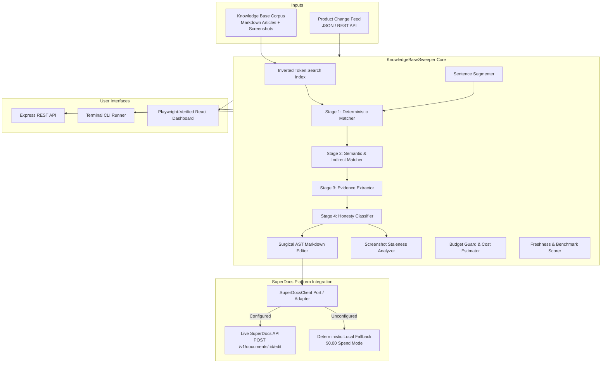

# Architecture Specification: Knowledge-base Freshness Sweeper

This document outlines the architectural design, component boundaries, data flow, trust model, and technical guarantees for the **Knowledge-base Freshness Sweeper** (Task 2.3).

---

## 1. System Overview & Component Hierarchy



---

## 2. SuperDocs Port / Adapter Integration Contract

The extension adheres strictly to a clean hexagonal port/adapter architecture:

```
                  ┌────────────────────────────────────────┐
                  │          KnowledgeBaseSweeper          │
                  └───────────────────┬────────────────────┘
                                      │
                                      ▼
                  ┌────────────────────────────────────────┐
                  │            SuperDocsClient             │
                  │        (src/core/superdocs-client.ts)   │
                  └───────┬────────────────────────┬───────┘
                          │                        │
       [SUPERDOCS_API_KEY set]          [SUPERDOCS_API_KEY unset / CI]
                          ▼                        ▼
        ┌───────────────────────────┐    ┌───────────────────────────┐
        │  Live SuperDocs REST API  │    │  Local Deterministic AST  │
        │  https://api.superdocs.app │    │  $0.00 Cost Fallback      │
        │  POST /v1/documents/:id   │    │  Zero Network Dependency  │
        └───────────────────────────┘    └───────────────────────────┘
```

### Endpoints Used:
- `POST /v1/documents`: Syncs article markdown, category metadata, and tags to SuperDocs.
- `POST /v1/documents/:id/edit`: Dispatches approved sentence-level patches in `mode="surgical"`.

---

## 3. Domain Entities & State Lifecycle

```
[ChangeEvent]
      │
      ▼
[Assessment] ──(if AFFECTED)──> [EditProposal] ──(Human Review)──> [Approved / Rejected]
      │                                                                  │
      ▼                                                                  ▼
[PortfolioMetrics] <────────────────────────────────────────── [Article Content Patch]
```

### Entity Schema & Roles:
- **`Article`**: Contains immutable `id`, raw `content` (Markdown), monotonically increasing `version`, category/tags metadata, embedded `screenshots` with OCR labels, and timestamp.
- **`ChangeEvent`**: Captures product delta with `before_state` (deprecated names, old limit values, previous UI paths, legacy workflow steps) and `after_state`.
- **`Assessment`**: Tri-state classification (`AFFECTED` | `NOT_AFFECTED` | `COULD_NOT_ASSESS`) accompanied by verified verbatim evidence items.
- **`EditProposal`**: Encapsulates targeted sentence mutation, character offset spans, and structural preservation metrics.
- **`ScreenshotAssessment`**: Identifies whether embedded UI screenshots require replacement due to visible text mismatches (`SCREENSHOT_REPLACEMENT_REQUIRED`).
- **`PortfolioMetrics`**: Exposes total articles, healthy count, stale count, could-not-assess count, freshness score, assessment coverage, precision, recall, F1, and cost accounting.

---

## 4. Multi-Stage Impact Discovery Pipeline

```
[Article Content]
       │
       ▼
[Stage 0: Sentence Segmentation]  --> Extracts sentences with section headings & char offsets
       │
       ▼
[Stage 1: Deterministic Matching] --> Exact names, UI paths, limit numbers, retired plans
       │
       ▼
[Stage 2: Semantic & Indirect]    --> Obsolete workflow steps, concept overlaps, adversarial filtering
       │
       ▼
[Stage 3: Evidence Extraction]    --> Verifies verbatim sentence quotes & section attribution
       │
       ▼
[Stage 4: Honesty Classification] --> Evaluates confidence: HIGH / MEDIUM / COULD_NOT_ASSESS
```

| Stage | Subsystem | Responsibility | Failure Mode / Fallback |
|---|---|---|---|
| **0** | `extractSentences` | Splits content into sentences while preserving offsets and headings | Standard punctuation regex fallback |
| **1** | `matchDeterministic` | Matches exact entity names, numbers, UI labels, and paths | Continues to Stage 2 |
| **2** | `matchSemantic` | Identifies indirect workflow descriptions and semantic overlap; filters false-positive traps | Ignored if no corroborated clues |
| **3** | `extractEvidence` | Verifies verbatim quote presence in article markdown | If quote missing, rejects match |
| **4** | `classifyAssessment` | Classifies confidence; catches ambiguous scopes and flags `COULD_NOT_ASSESS` | Low confidence $\to$ `COULD_NOT_ASSESS` |

---

## 5. Structural Preservation Guarantees

The AST Markdown Patcher enforces the following invariant:

$$\forall \text{ proposal } P, \quad \text{Preservation}(P) \ge 95\% \quad \land \quad \Delta(\text{Headings}) = 0 \quad \land \quad \Delta(\text{CodeBlocks}) = 0 \quad \land \quad \Delta(\text{Links}) = 0$$

- Surrounding markdown headings (`# Header`), bullet lists (`- item`), code blocks (` ``` `), and hyperlinks (`[label](url)`) outside the target sentence are guaranteed to remain bit-for-bit identical.

---

## 6. Honest Uncertainty & Could-Not-Assess Policy

The system **never** converts uncertainty into a false negative or false positive. When confidence is insufficient, `status = COULD_NOT_ASSESS` is returned alongside:
1. `what_checked`: List of terms and structural elements inspected.
2. `missing_evidence`: Specific reason why certainty could not be established (e.g. variable enterprise contracts, unverified draft status, missing OCR labels).
3. `why_insufficient`: Explanation for the human content manager.

---

## 7. Budget Guard & Cost Accounting

Pre-flight cost estimation ensures that batch runs cannot accidentally incur runaway model charges:
$$\text{Tokens} = \lceil \text{Characters} / 4 \rceil$$
$$\text{Cost} = \frac{\text{Input Tokens}}{1000} \times C_{\text{in}} + \frac{\text{Output Tokens}}{1000} \times C_{\text{out}}$$
If $\text{Cost} > \text{Budget Cap}$, execution is aborted immediately before any inference calls are made.

---

## 8. Playwright Headed E2E Testing Architecture

The end-to-end test suite (`e2e/freshness_sweeper.spec.ts`) automates a complete human reviewer session in a headed browser:
- Theme toggling & CSS variable validation
- Small-sample mode (`--sample 5`)
- Full 32-article corpus sweep
- Proposal inspection, sentence diff review, and patch approval
- Article search & inverted index query execution
- Screenshot OCR staleness verification
- Honest could-not-assess disclosures inspection
- Ground-truth evaluation matrix verification
- Budget guard configuration verification
