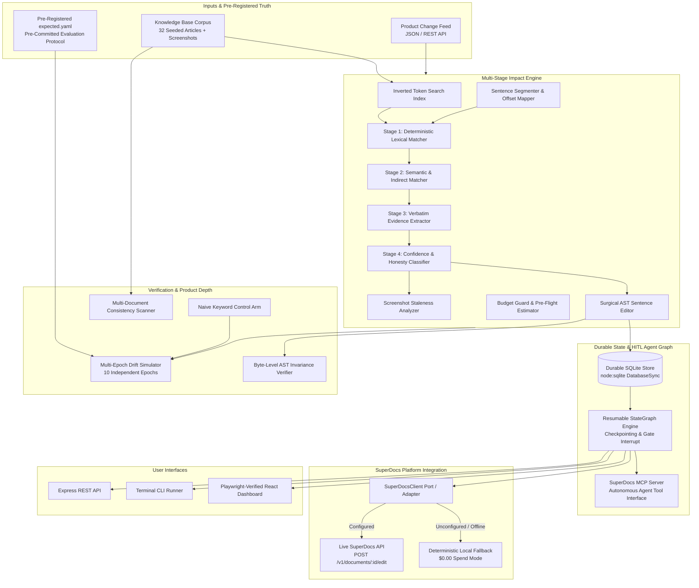
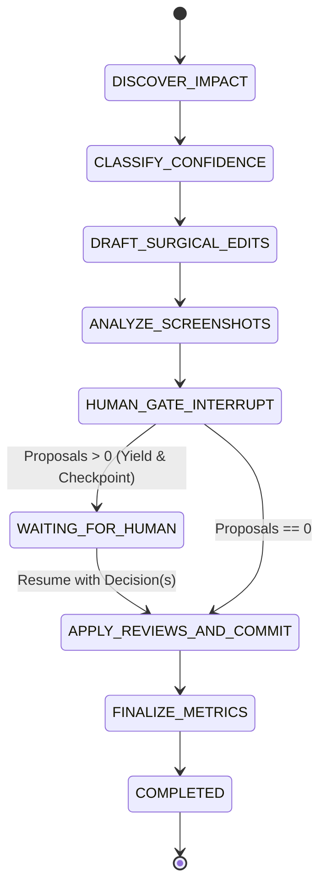

# Architecture Specification: Knowledge-base Freshness Sweeper

> **SuperDocs Extension (Task 2.3)**  
> Comprehensive technical specification of the multi-stage impact detector, durable SQLite storage, resumable StateGraph agent-loop, MCP server interface, AST invariance verification, and scientific evaluation harness.

---

## 1. System Overview & Component Topology



---

## 2. Durable State Architecture (`src/core/db.ts`)

The persistent layer is built with Node 26 native `node:sqlite` (`DatabaseSync`), requiring zero external native binaries or compilation dependencies.

### Database Schema
```sql
CREATE TABLE IF NOT EXISTS articles (
  id TEXT PRIMARY KEY,
  title TEXT NOT NULL,
  content TEXT NOT NULL,
  version INTEGER NOT NULL DEFAULT 1,
  metadata_json TEXT,
  screenshots_json TEXT,
  last_updated TEXT NOT NULL
);

CREATE TABLE IF NOT EXISTS change_events (
  id TEXT PRIMARY KEY,
  type TEXT NOT NULL,
  title TEXT NOT NULL,
  description TEXT NOT NULL,
  before_state_json TEXT NOT NULL,
  after_state_json TEXT NOT NULL,
  effective_date TEXT NOT NULL,
  source TEXT NOT NULL
);

CREATE TABLE IF NOT EXISTS sweeps (
  id TEXT PRIMARY KEY,
  created_at TEXT NOT NULL,
  provider TEXT NOT NULL,
  total_articles INTEGER NOT NULL,
  affected_articles INTEGER NOT NULL,
  freshness_score REAL NOT NULL,
  cost REAL NOT NULL,
  metrics_json TEXT NOT NULL
);

CREATE TABLE IF NOT EXISTS proposals (
  id TEXT PRIMARY KEY,
  sweep_id TEXT,
  article_id TEXT NOT NULL,
  change_id TEXT NOT NULL,
  original_content TEXT NOT NULL,
  proposed_content TEXT NOT NULL,
  changed_spans_json TEXT NOT NULL,
  rationale TEXT NOT NULL,
  evidence_json TEXT NOT NULL,
  confidence TEXT NOT NULL,
  status TEXT NOT NULL, -- PENDING | APPROVED | REJECTED
  structural_preservation_ratio REAL NOT NULL,
  created_at TEXT NOT NULL,
  reviewed_at TEXT,
  reviewer TEXT,
  review_notes TEXT,
  FOREIGN KEY(article_id) REFERENCES articles(id)
);

CREATE TABLE IF NOT EXISTS review_audit_log (
  id TEXT PRIMARY KEY,
  proposal_id TEXT NOT NULL,
  decision TEXT NOT NULL, -- APPROVED | REJECTED
  reviewer TEXT NOT NULL,
  notes TEXT,
  timestamp TEXT NOT NULL,
  FOREIGN KEY(proposal_id) REFERENCES proposals(id)
);

CREATE TABLE IF NOT EXISTS agent_checkpoints (
  id TEXT PRIMARY KEY,
  thread_id TEXT NOT NULL UNIQUE,
  current_step TEXT NOT NULL,
  is_interrupted INTEGER NOT NULL DEFAULT 0,
  state_json TEXT NOT NULL,
  created_at TEXT NOT NULL,
  updated_at TEXT NOT NULL
);
```

---

## 3. Resumable StateGraph Workflow & Gate Interrupts (`src/core/agent-graph.ts`)

The agent loop executes as a stateful graph engine with deterministic checkpointing and human-in-the-loop (HITL) gate interrupts:



### Graph Execution Mechanics:
1. `start(threadId, articles, changes)`: Initializes graph state, persists parent entities to SQLite, traverses discovery and surgical drafting nodes, and interrupts at `HUMAN_GATE_INTERRUPT`.
2. **State Checkpointing**: The full serialized `GraphState` is persisted to `agent_checkpoints` in SQLite with `is_interrupted = 1`.
3. `resume(threadId, reviewDecisions)`: Restores checkpoint state, applies approved surgical patches to articles, logs review audit events, increments article versions, and finalizes portfolio freshness metrics.

---

## 4. Model Context Protocol (MCP) Server (`src/mcp/server.ts`)

The sweeper implements standard Model Context Protocol (MCP) tools, enabling external autonomous AI agents to drive review workflows programmatically:

| Tool Name | Input Parameters | Return Value | Description |
|---|---|---|---|
| `sweep_knowledge_base` | `thread_id`, `articles`, `changes` | Execution status, node, proposal counts | Starts a new state graph workflow sweep. |
| `list_pending_proposals` | `thread_id` (optional) | Array of pending `EditProposal` objects | Retrieves proposals awaiting signoff. |
| `submit_review_decision` | `thread_id`, `proposal_id`, `decision`, `reviewer`, `notes` | Resumed state, applied count, updated metrics | Submits human or agent decision and advances graph. |
| `get_portfolio_freshness` | `thread_id` | `PortfolioMetrics` object | Returns freshness score, coverage, and CNA rate. |

---

## 5. Multi-Stage Impact Discovery & Scientific Control Arm

### 5.1. The 4-Stage Detection Pipeline
1. **Stage 1 (Deterministic Lexical Matching)**: Exact numeric limits (`10,000`), UI navigation paths (`Settings > Billing > Plans`), and retired plan keys (`Legacy Pro`).
2. **Stage 2 (Semantic & Indirect Matching)**: Obsolete multi-step workarounds (e.g. manual row-by-row export), behavioral synonyms, and contextual term co-occurrence filters guarding against adversarial keyword traps (`growth`, `limit`, `subscribing`).
3. **Stage 3 (Verbatim Evidence Extraction)**: Isolates exact sentence quotes and section headings, validating presence in raw article markdown before proposing edits.
4. **Stage 4 (Confidence & Honesty Classifier)**: Evaluates certainty. Discloses ambiguous beta workflows, variable custom SLA contracts, or missing OCR labels into `COULD_NOT_ASSESS`.

### 5.2. Control Arm Baseline (`src/core/control-arm.ts`)
A naive keyword-only baseline detector that extracts unigram tokens from change metadata without sentence segmentation or honesty thresholds. Used as the scientific control arm during multi-epoch drift benchmarks.

---

## 6. AST Byte-Level Invariance & Multi-Document Verification

### 6.1. Structural Invariance Verifier (`src/core/ast-verifier.ts`)
Formally proves that surgical edits preserve 100% byte invariance for all non-target markdown elements:

$$\forall P \in \text{Proposals}: \quad \Delta(\text{Headings}) = 0, \quad \Delta(\text{CodeBlocks}) = 0, \quad \Delta(\text{Tables}) = 0, \quad \Delta(\text{Links}) = 0, \quad S_p \ge 98.9\%$$

### 6.2. Cross-Document Consistency Scanner (`src/core/consistency-checker.ts`)
Scans multi-document libraries to detect:
- **`CONTRADICTING_LIMITS`**: Numeric quota discrepancies across related articles (e.g. 5 MB vs 25 MB file upload limit).
- **`DISCREPANT_PLAN_NAME`**: Co-existence of deprecated plan tiers (`Legacy Pro`) alongside active tier references.
- **`BROKEN_CROSS_REFERENCE`**: Broken slugs or cross-document hyperlinks.

---

## 7. SuperDocs Port / Adapter Integration Contract

Adheres to a clean hexagonal port/adapter architecture:

```
                  ┌────────────────────────────────────────┐
                  │          KnowledgeBaseSweeper          │
                  └───────────────────┬────────────────────┘
                                      │
                                      ▼
                  ┌────────────────────────────────────────┐
                  │            SuperDocsClient             │
                  │        (src/core/superdocs-client.ts)   │
                  └───────┬────────────────────────┬───────┘
                          │                        │
       [SUPERDOCS_API_KEY set]          [SUPERDOCS_API_KEY unset / CI]
                          ▼                        ▼
        ┌───────────────────────────┐    ┌───────────────────────────┐
        │  Live SuperDocs REST API  │    │  Local Deterministic AST  │
        │  https://api.superdocs.app │    │  $0.00 Cost Fallback      │
        │  POST /v1/documents/:id   │    │  Zero Network Dependency  │
        └───────────────────────────┘    └───────────────────────────┘
```

---

## 8. Budget Guard & Cost Governance

Pre-flight cost estimation ensures that batch runs cannot accidentally incur runaway model charges:

$$\text{Tokens}_{\text{est}} = \lceil \text{Characters}_{\text{body}} \times 0.35 \rceil$$
$$\text{Cost}_{\text{est}} = \frac{\text{Tokens}_{\text{in}}}{1000} \times C_{\text{in}} + \frac{\text{Tokens}_{\text{out}}}{1000} \times C_{\text{out}}$$

If $\text{Cost}_{\text{est}} > \text{Budget Cap}$, execution aborts immediately before initiating any inference network requests. In deterministic offline mode, execution is guaranteed at **$0.00 spend**.
