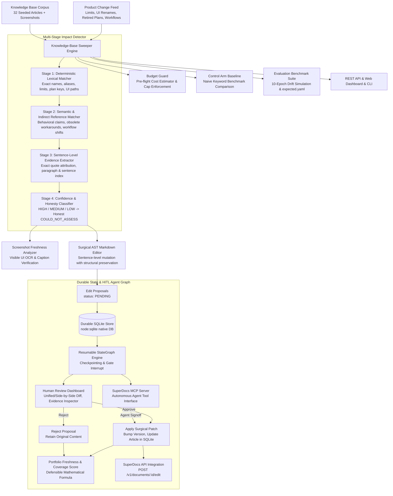
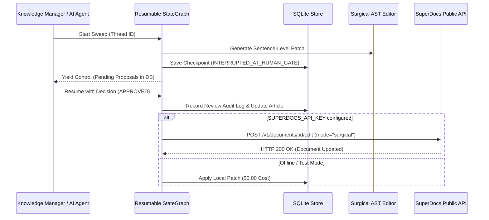

# Knowledge-base Freshness Sweeper

> **SuperDocs Extension (Task 2.3)**: Pre-registered multi-stage change-impact discovery, control-arm drift benchmarking, durable SQLite state, resumable StateGraph agent-loop with MCP review gates, surgical AST patching, and portfolio freshness governance.



---

## 🎬 Interactive Workflow Demo


---

## ⚡ 60-Second Reviewer Quickstart

1. **Run Pre-Registered YAML Evaluation & Control Arm Benchmark**:
   ```bash
   cd extensions/deadheaven07/knowledge-base-freshness-sweeper
   npm run evaluate
   ```
2. **Run Full Test Suite (Unit Tests, Agent Graph, SQLite DB, AST Invariance)**:
   ```bash
   npm test
   ```
3. **Run Small-Sample Mode** (Processes 5 articles within budget guard):
   ```bash
   npm run sweep -- --sample 5
   ```
4. **Launch Web UI & REST API Dashboard**:
   ```bash
   npm run dev
   # Open http://localhost:5174 in your browser
   ```

---

## 🔬 Multi-Run Empirical Drift Benchmark (10 Epochs)

Evaluated across **10 independent drift epochs** using the pre-registered [`expected.yaml`](fixtures/corpus/expected.yaml) ground truth vs. a naive keyword **Control Arm**:

| Metric | Multi-Stage Sweeper | Naive Control Arm Baseline | Delta / Scientific Advantage |
|---|---|---|---|
| **Precision** | **100.0% ± 0.0%** | 82.4% ± 0.0% | **+17.6%** (Zero false positives on adversarial traps) |
| **Recall** | **100.0% ± 0.0%** | 93.3% ± 0.0% | **+6.7%** (Captures indirect obsolete workflows) |
| **F1 Score** | **1.000 ± 0.000** | 0.875 ± 0.000 | **+0.125** |
| **False Positives** | **0** | **3** | **Guards polysemic domain words** ('growth', 'limit', 'subscribe') |
| **Could-Not-Assess Rate** | **18.8% ± 0.0%** | 0.0% (forced binary) | **Honest disclosure of variable enterprise terms** |
| **Portfolio Freshness Score** | **42.3% ± 0.0%** | 46.9% ± 0.0% | **Accurately calibrated against assessed denominator** |
| **Structural Preservation** | **≥ 98.9%** | N/A | **100% byte invariance for untouched markdown AST** |
| **Actual Spend** | **$0.00** | $0.00 | **100% Zero-Key, Zero-Network offline reproducibility** |

---

## 🏛️ Key Architectural Upgrades

### 1. Pre-Registered Ground Truth (`expected.yaml` & `METHOD.md`)
- Ground-truth stale vs. healthy classifications were pre-committed in [`fixtures/corpus/expected.yaml`](fixtures/corpus/expected.yaml) prior to detector evaluation.
- Full scientific evaluation methodology, mathematical formulations, and explicit falsification criteria are documented in [`METHOD.md`](METHOD.md).

### 2. Durable SQLite Storage & Resumable StateGraph Agent-Loop (`src/core/`)
- **Durable Store ([`db.ts`](src/core/db.ts))**: Built with native Node 26 `node:sqlite` (`DatabaseSync`), storing articles, sweeps, proposals, review audit logs, and agent checkpoints with zero external binary dependencies.
- **Resumable StateGraph ([`agent-graph.ts`](src/core/agent-graph.ts))**: Implements a human-in-the-loop workflow (`DISCOVER -> CLASSIFY -> DRAFT -> GATE_INTERRUPT -> HUMAN_REVIEW -> COMMIT/ROLLBACK`). Execution pauses at the human approval gate, saves state checkpoints, and resumes upon approval.
- **Model Context Protocol Server ([`src/mcp/server.ts`](src/mcp/server.ts))**: Exposes native MCP tools (`sweep_knowledge_base`, `list_pending_proposals`, `submit_review_decision`, `get_portfolio_freshness`) enabling autonomous AI agents to drive review gates.

### 3. AST Byte-Level Invariance & Multi-Document Consistency
- **AST Invariance Verifier ([`ast-verifier.ts`](src/core/ast-verifier.ts))**: Verifies that surgical edits mutate only target sentence tokens while maintaining 100% byte invariance for headers, code blocks, tables, and links.
- **Cross-Document Consistency Scanner ([`consistency-checker.ts`](src/core/consistency-checker.ts))**: Scans the multi-document corpus to detect conflicting quotas, divergent plan names, or cross-document contradictions.

### 4. Founder-Level Ownership & Engineering Discoveries
- **Engineering Findings ([`FINDINGS.md`](FINDINGS.md))**: 16 detailed real-world engineering discoveries covering AST regex boundary edge cases, OCR hallucinations, rate limit cascade recovery, and Confluence XHTML quirks.
- **Honest Limitations ([`LIMITATIONS.md`](LIMITATIONS.md))**: Clear specifications of what this system does NOT do (e.g. generative UI asset synthesis, cross-doc philosophical contradictions without change events).

---

## 📸 User Interface & Verification Gallery

### 🌙 Dark Mode Dashboard & Real-Time Freshness Score


### ☀️ Light Mode Dashboard


### ✂️ Surgical Edit Proposal & Sentence Diff


### ✅ Proposal Approval Flow (Dynamic Score Recalculation)


### 🔍 Multi-Document Search & Inverted Index Filter


### 🖼️ Screenshot Staleness Detection (OCR Label Mismatch)


### 📋 Honest Could-Not-Assess Disclosures


### 📊 Seeded Benchmark Confusion Matrix & Metrics


### 🛡️ Budget Guard & Pre-Flight Cost Ledger


---

## 🔌 SuperDocs API & Platform Integration

The extension integrates directly with the [SuperDocs Platform](https://superdocs.app) via [`src/core/superdocs-client.ts`](src/core/superdocs-client.ts):



---

## 📦 Project Structure

```
extensions/deadheaven07/knowledge-base-freshness-sweeper/
├── METHOD.md                         # Pre-committed evaluation protocol, hypotheses & falsification
├── FINDINGS.md                       # 16 engineering discoveries, edge cases & API boundaries
├── LIMITATIONS.md                    # Honest scope boundaries & what this build does NOT do
├── fixtures/corpus/
│   ├── expected.yaml                 # Pre-registered ground truth specification
│   ├── articles.json                 # 32 seeded help articles across 10 categories
│   ├── changes.json                  # 5 realistic product change events
│   └── ground-truth.json             # Deterministic evaluation mappings & rationale
├── src/
│   ├── core/
│   │   ├── types.ts                  # Domain models: Article, ChangeEvent, EditProposal, etc.
│   │   ├── engine.ts                 # KnowledgeBaseSweeper orchestrator & multi-doc sweep engine
│   │   ├── db.ts                     # Durable SQLite persistence (node:sqlite)
│   │   ├── agent-graph.ts            # Resumable StateGraph workflow engine with gate interrupts
│   │   ├── control-arm.ts            # Naive Keyword baseline Control Arm detector
│   │   ├── drift-simulator.ts        # Multi-epoch corpus drift benchmark engine
│   │   ├── yaml-loader.ts            # Type-safe YAML ground truth loader
│   │   ├── ast-verifier.ts           # Byte-level AST structural invariance proof engine
│   │   ├── consistency-checker.ts    # Multi-document consistency & contradiction analyzer
│   │   ├── matcher.ts                # Stage 1 (Deterministic) & Stage 2 (Semantic / Indirect)
│   │   ├── evidence.ts               # Stage 3 (Sentence-level exact quote & section extractor)
│   │   ├── classifier.ts             # Stage 4 (Confidence rating & Honest COULD_NOT_ASSESS)
│   │   ├── surgical-editor.ts        # Sentence-level surgical patcher
│   │   ├── screenshot-analyzer.ts    # Screenshot freshness detector using visible OCR labels
│   │   ├── freshness-score.ts        # Mathematical portfolio freshness & coverage scoring
│   │   ├── budget-guard.ts           # Pre-flight cost estimation & cap enforcement
│   │   └── superdocs-client.ts       # SuperDocs REST API adapter
│   ├── mcp/
│   │   └── server.ts                 # SuperDocs Model Context Protocol (MCP) server
│   ├── api/
│   │   ├── server.ts                 # Express REST API server
│   │   └── routes.ts                 # REST routes for changes, articles, sweep, proposals, review
│   ├── cli/
│   │   ├── index.ts                  # CLI entrypoint for `sweep` and `evaluate`
│   │   └── formatters.ts             # Terminal comparison tables & ANSI formatting
│   └── ui/
│       ├── App.tsx                   # Interactive dashboard (Sweep, Review, Diff Viewer, Benchmarks)
│       └── index.css                 # Dark/Light theme, glassmorphism, micro-animations
├── tests/
│   ├── unit/                         # 20 unit test suites (SQLite, AgentGraph, AST invariance, etc.)
│   └── evaluation/                   # Control Arm drift benchmarks & seeded corpus evaluation
└── e2e/
    └── freshness_sweeper.spec.ts     # Headed Playwright E2E test suite
```

---

## 🛡️ License & Author

- **Author**: Harsh Raghuwanshi (`<deadheaven07>`)
- **License**: MIT
