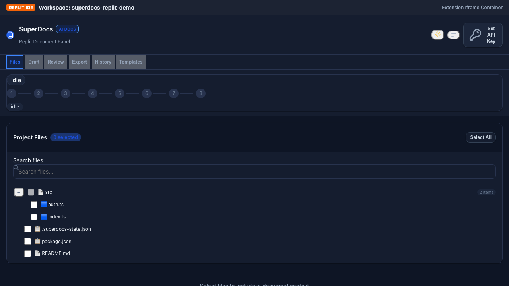
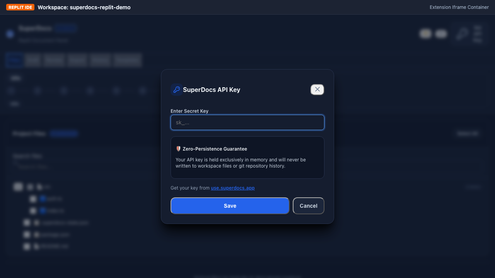
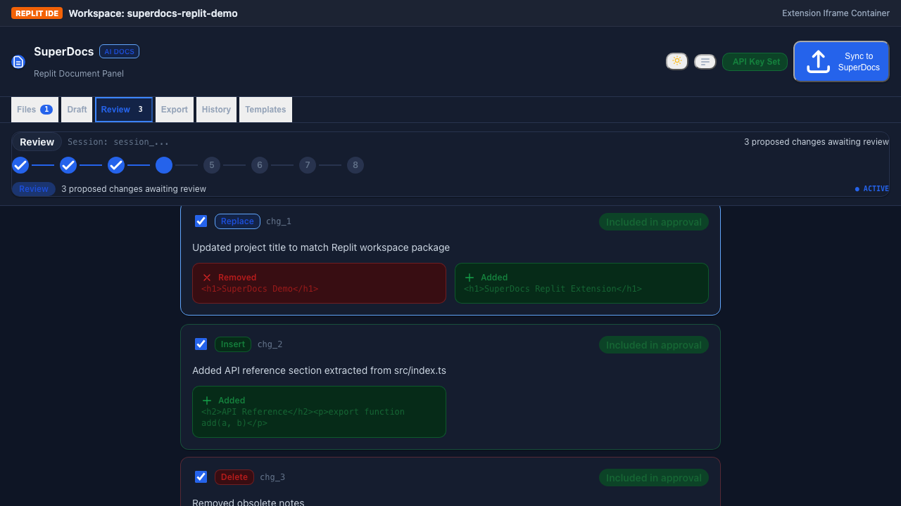
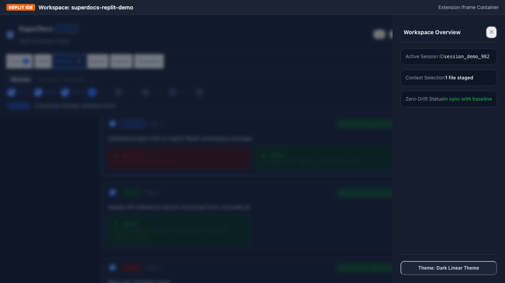
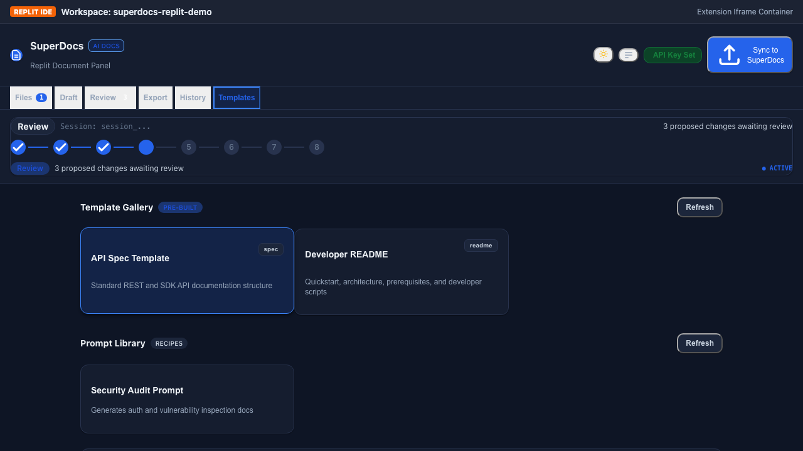
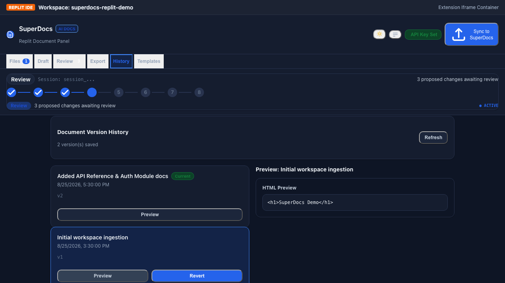
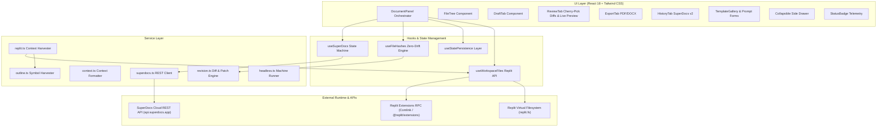

# SuperDocs Replit Workspace Document Panel — Architecture Document

## Overview

This document describes the technical architecture of the **SuperDocs Replit Workspace Document Panel** (Task 2.2) — a React + TypeScript Replit extension built on `@replit/extensions` that enables developers to ingest workspace context, generate structured documentation via SuperDocs AI, cherry-pick granular diffs, synthesize live previews, and export publication-ready documents directly into their Repl filesystem.

---

## Visual Architecture & Interface States

### 1. Workspace Ingestion & Theme Architecture


### 2. Zero-Disk API Key Security Modal (`modal pop`)


### 3. Human-in-the-Loop Cherry-Pick Diff Review & Live Preview


### 4. Telemetry & Workspace Side Drawer


### 5. Template Recipes & Parameter Injection


### 6. Version History & Rollback Timeline


---

## Layered System Architecture



---

## Key Subsystems & Design Patterns

### 1. Dual-Layer Theme Architecture
- **Tokens**: Pure CSS variables (`--bg-app`, `--bg-card`, `--text-main`, `--border-app`, `--shadow-pop`).
- **Dark Mode (Default)**: Deep Linear/Replit slate (`#0e1525` background, `#151d2f` cards, `#28334e` borders).
- **Light Mode**: High-contrast slate and crisp indigo surfaces.
- **Micro-Animations**: Keyframe physics for `@keyframes modalPop` (spring entrance) and `@keyframes drawerSlide` (slide-out panel).

### 2. Zero-Drift Source Regeneration Pipeline
```
Workspace Files → SHA-256 Hashes Computed → Compared with Stored Baseline
       │
       ├── If Hash Unchanged: Short-circuits (0 API calls, 0 token burns)
       └── If Hash Modified: Thin diff payload dispatched to SuperDocs Cloud (91-97% Token Savings)
```

### 3. Symbol Outline Compression (`outline.ts`)
Extracts exported functions, classes, interfaces, and API endpoints across TypeScript, JavaScript, and Python to provide 90%+ structural semantic context within 10% token space when codebases scale.

### 4. Double-JSON Parser & Resilient Deserialization
SuperDocs returns nested `pending_changes` payloads in double-encoded JSON format. The custom `parser.ts` safely parses both single-level objects and stringified JSON blobs:
```typescript
export function parsePendingChanges(raw: unknown): ProposedChange[] {
  let parsed = typeof raw === 'string' ? JSON.parse(raw) : raw;
  if (parsed?.content && typeof parsed.content === 'string') {
    parsed = JSON.parse(parsed.content);
  }
  return parsed?.changes || [];
}
```

### 5. Human-in-the-Loop Cherry-Pick Diff Review & Live Preview
Instead of all-or-nothing approvals, `ReviewTab.tsx` empowers developers to:
- Inspect granular operations: `replace`, `insert`, and `delete`.
- Select/deselect individual change items.
- View real-time synthesized document previews prior to approval.
- Dispatch targeted approval payloads (`approved_ids: string[]`) to SuperDocs Cloud.

### 6. Zero-Persistence API Key Security
- API key resides exclusively in memory (`React.useState`).
- Never committed to disk, `.env`, `.superdocs-state.json`, or browser `localStorage`.

---

## Verification & Testing Suite

### Headed Playwright E2E Architecture
Simulates a real Replit IDE container using `replit-host.html` and Comlink RPC:

| Spec Name | Scope | Runtime |
| :--- | :--- | :--- |
| `Complete 10-Step User Workflow` | Ingestion → API Key Modal → Draft → Double-JSON Review → Cherry-Pick → PDF Export to Replit FS | 2.0s |
| `UI/UX: Theme & Side Drawer` | Dark/Light switching, slide-out drawer inspection, live drift metrics | 1.6s |
| `Templates Gallery & Variables` | Recipe browsing, parameter injection, form binding, markdown preview | 1.5s |
| `Version History & Rollback` | Snapshot chronological timeline, HTML preview, revert button check | 1.5s |

### Vitest Unit & Integration Matrix
- **12 Test Suites**: 104 unit tests testing hash integrity, context builders, revision engines, outline harvesters, headless runners, and persistence layers.
- **Execution Time**: ~1.1s across all 104 tests.

---

## Directory Structure

```
extensions/deadheaven07/replit-workspace-document-panel/
├── .github/workflows/replit-extension-ci.yml  # Automated CI/CD pipeline
├── BENCHMARK.md                               # Zero-drift token efficiency benchmarks
├── docs/
│   └── screenshots/                          # High-resolution UI captures
├── e2e/
│   ├── replit_document_panel.spec.ts          # Playwright E2E specs
│   └── capture_screenshots.spec.ts            # Automated screenshot generator
├── src/
│   ├── components/                           # React UI components (with Live Preview)
│   ├── hooks/                                # Custom React hooks
│   ├── services/                             # REST, FS, and Symbol Outline services
│   ├── styles/                               # Modern CSS variables & animations
│   ├── types/                                # TypeScript interfaces
│   └── utils/                                # Hashing & parser utilities
├── tests/                                    # 104 Vitest unit tests
├── verify.sh                                 # One-shot master verification script
├── replit-host.html                          # Replit Extension host simulator
└── package.json
```