# Replit Workspace Document Panel

A Replit extension that adds a document panel to the workspace, allowing users to generate, edit, and export README, specification, and user guide documents using the SuperDocs AI platform.

> **I built this for the SuperDocs task.**

## Features

- **Project File Discovery**: Recursively scans the Replit workspace, filtering out dependencies, build artifacts, and binary files
- **Smart File Selection**: Interactive file tree with checkboxes and search for selecting relevant source/config/documentation files
- **Document Generation**: Generate README, Technical Specification, or User Guide documents through SuperDocs AI
- **Edit Workflow**: Send natural language instructions to SuperDocs for iterative document refinement
- **Proposed Changes Review**: View and approve/reject AI-proposed changes with diff visualization
- **Export**: Export finished documents as styled PDF or DOCX
- **Workspace Integration**: Save exported artifacts directly into the Replit project
- **Revision Detection**: Detect code changes and regenerate documents reflecting those changes
- **Cancellation**: Cancel in-flight operations at any time
- **Retry & Error Recovery**: Automatic retry for transient failures with user-facing retry/dismiss actions
- **File Loading Indicator**: Visual feedback during project file reads

## Core Capabilities

| Capability | Implementation |
|------------|----------------|
| **Surgical Edits** | Chunk-based diffs via `approval_mode: 'ask_every_time'`. SuperDocs returns granular `ProposedChange` operations (insert/replace/delete/move) with `chunk_id` targeting. The extension uses `requestSurgicalEdits()` to send only code deltas (changed/added/removed files) to the same SuperDocs session, avoiding full document regeneration and preserving manual user edits. |
| **Dual-Layer State Persistence** | State survives browser tab refresh via two synchronized stores: **localStorage** (instant, per-browser) + **`.superdocs-state.json`** in the Replit workspace (survives browser clear, portable across machines). Persisted fields: `sessionId`, `documentId`, `documentType`, `selectedPaths`, `fileHashes` (SHA-256 baselines), `originalInstruction`, `lastUpdated`, `version`. On load, the extension merges both sources preferring the most recent `lastUpdated`. |
| **Dynamic `.gitignore` Parsing** | Replaces hardcoded exclusion lists with a runtime `.gitignore` parser (`src/utils/gitignore.ts`). On startup, reads `.gitignore` from the Replit workspace via `replit.fs.readFile`, parses patterns (negation `!`, directory-only `/`, absolute paths, globs `**`, `*`, `?`), and combines with sensible defaults (`.env*`, lock files, binary extensions). File tree filtering uses `shouldIgnore(path, isDirectory)` for both UI display and context inclusion. |

## Resilience & Architecture

### State Survival Across Tab Refresh

The extension's dual-layer persistence ensures no work is lost on browser tab refresh, navigation away, or even switching machines:

1. **On every state change** (file selection, hash capture, session creation, document export), `useStatePersistence` writes to both `localStorage` and `.superdocs-state.json` atomically.
2. **On load**, the hook reads both sources. If both exist, it picks the one with the newer `lastUpdated` timestamp. This handles the case where `.superdocs-state.json` was edited on another machine and is fresher than local browser storage.
3. **Restored state** includes the active SuperDocs `sessionId` and `documentId`, so the "Check for Code Changes" button works immediately without re-generating the document. File selections and SHA-256 baselines are also restored, enabling instant revision detection.

### Delta-Based Code Change Handling (No Overwrites)

The surgical edit workflow prevents manual document edits from being overwritten:

1. **Change Detection**: On "Check for Code Changes", the extension re-reads selected files and computes SHA-256 hashes. It compares against the persisted `fileHashes` baseline to produce a precise diff: `{ changed: [], added: [], removed: [] }`.
2. **Delta Instruction**: Instead of re-sending all project files, `handleSurgicalEdit()` constructs a `SurgicalEditInstruction` containing only the changed files (with old/new content), added files, and removed file paths.
3. **SuperDocs API Call**: The instruction is sent via `/v1/chat/async` with `approval_mode: 'ask_every_time'` to the **existing session** (`sessionId` reused). SuperDocs returns a `ProposedChangeBatch` of granular operations targeting specific `chunk_id`s.
4. **User Review**: The Review tab shows each operation (Insert/Replace/Delete/Move) with before/after HTML snippets and AI explanations. The user approves or rejects individually or in bulk.
5. **Apply**: On approval, `/v1/chat/{session_id}/approve` applies only the approved operations to the document. The document is patched in place — no full replacement occurs.
6. **Export & Baseline Update**: After successful export, `captureHashes()` updates the persisted baseline to the current file state, ready for the next revision cycle.

This architecture ensures:
- **Manual edits preserved**: User's direct edits to the document between generations are never lost because SuperDocs patches specific chunks, not the whole document.
- **Minimal API traffic**: Only deltas are sent, reducing token usage and latency.
- **Audit trail**: Each revision is a set of approved operations on the same document version, not a new document.

## Architecture

```mermaid
flowchart TD
    subgraph Replit_Workspace["Replit Workspace"]
        ProjectFiles["Project Files / File Tree"]
    end

    subgraph React_UI["React UI Layer"]
        DocumentPanel["DocumentPanel"]
        FileTree["FileTree"]
        DraftTab["DraftTab"]
        ReviewTab["ReviewTab"]
        ExportTab["ExportTab"]
        StatusBadge["StatusBadge"]
    end

    subgraph Workspace_Services["Workspace Services"]
        ReplitAccess["Replit File Access"]
        ContextGen["Project Context Generation"]
        SHA256["SHA-256 File Hashing"]
        RevisionDetect["Revision / Change Detection"]
    end

    subgraph UseSuperDocs_Hook["useSuperDocs Hook"]
        GenState["Generation State"]
        Cancellation["Cancellation"]
        Retry["Retry"]
        ErrorRecovery["Error Recovery"]
        RevisionState["Revision State"]
    end

    subgraph SuperDocs_Client["SuperDocs Client"]
        Session["Session Init"]
        Upload["Document Upload"]
        Chat["Chat / Generation"]
        Polling["Job Polling"]
        Approval["Approval / Rejection"]
        Continue["Continuation"]
        Export["PDF / DOCX Export"]
    end

    SuperDocs_API["SuperDocs API"]

    ProjectFiles --> React_UI
    React_UI --> Workspace_Services
    Workspace_Services --> UseSuperDocs_Hook
    UseSuperDocs_Hook --> SuperDocs_Client
    SuperDocs_Client --> SuperDocs_API
```



### Layer Responsibilities

| Layer | Responsibilities |
|-------|------------------|
| **React Components** | Presentation, user interaction, tab navigation, form handling |
| **`useSuperDocs` Hook** | Operation lifecycle, state machine, cancellation, retry, error recovery, revision state |
| **`superdocs.ts` Client** | API requests, retry policy, AbortSignal propagation, response parsing |
| **Replit Services** | Workspace file access (`readDir`, `readFile`, `writeFile`, `createDir`) |
| **Context Utilities** | Project context and SuperDocs instruction construction |
| **Hash Utilities** | SHA-256 hashing, change detection between revisions |

## SuperDocs Integration

This extension uses the **SuperDocs REST API** with the following endpoints:

| Operation | Endpoint | Method |
|-----------|----------|--------|
| Session Init | `/v1/sessions/init` | POST |
| Upload Document | `/v1/documents/upload-base64` | POST |
| Chat/Edit Instruction | `/v1/chat/async` | POST |
| Poll Job Status | `/v1/jobs/{job_id}` | GET |
| Approve Changes | `/v1/chat/{session_id}/approve` | POST |
| Continue Job | `/v1/chat/{session_id}/continue` | POST |
| Export Document | `/v1/documents/export` | POST |

**Important**: SuperDocs returns proposed changes as a **double-JSON-encoded string** that requires two parse passes. This is handled automatically by `src/utils/parser.ts`.

## Reliability and Failure Handling

### Safe Retry Policy

The client implements a deliberate retry policy: only safe/read-oriented operations are retried automatically. Mutation operations are **not** retried to avoid duplicate jobs, duplicate uploads, or unintended side effects.

| Operation | Retries | Reason |
|-----------|---------|--------|
| `initSession` | Yes (3×) | Idempotent-ish; safe to retry |
| `pollJob` | Yes (3×) | Read-only; transient failures common |
| `waitForJob` | Yes (3×) | Wraps `pollJob` |
| `uploadDocument` | No | Mutation — would create duplicate documents |
| `chatAsync` | No | Mutation — would create duplicate generation jobs |
| `approveChanges` | No | Mutation — non-idempotent approval |
| `continueJob` | No | Mutation — non-idempotent continuation |
| `exportDocument` | No | Mutation — would create duplicate exports |

**Retry Behavior**:
- Exponential backoff: 1s → 2s → 4s (configurable via `RetryConfig`)
- Retries only on network errors, timeouts, and 502/503/504 responses
- Never retries on 401, 403, 400, 404
- Test retry config injectable via constructor (`createSuperDocsClient(apiKey, baseUrl, { maxRetries, retryDelayMs })`)

### Cancellation

Cancellation is implemented with `AbortController` and propagated through the entire request chain:

```
DocumentPanel → useSuperDocs → SuperDocsClient → fetch()
```

The `AbortSignal` reaches the actual HTTP request, so cancelling genuinely aborts in-flight network calls rather than merely updating UI state. `AbortError` is caught and suppressed — it does not appear as a user-facing failure.

### Error Recovery

| UI Element | Behavior |
|------------|----------|
| **Error Banner** | Shows error message with "Retry" and "Dismiss" buttons |
| **Retry** | Re-runs the last generation with the same instruction |
| **Dismiss** | Clears error and returns to idle state |
| **Cancel Button** | Visible during any processing state; aborts current operation |
| **File Loading Indicator** | Spinner + "Reading project files..." during batch file reads |
| **No-Changes Toast** | Blue toast notification when revision scan detects no changes (replaces `alert()`) |

## Revision Handling

The revision workflow uses **surgical edits** (granular chunk operations) instead of full document regeneration. This preserves any manual edits users make to the document between generations.

### Workflow

1. **Initial Generation**
   - Selected project files are read
   - SHA-256 hashes captured as baseline (persisted to localStorage + `.superdocs-state.json`)
   - Original user instruction stored separately
   - Document generated via SuperDocs (new session)

2. **Revision Trigger**
   - User modifies project code
   - Clicks "Check for Code Changes & Apply Surgical Edits"
   - Selected files re-read, current hashes computed
   - Changed/added/removed files identified by hash comparison

3. **Surgical Edit Instruction Construction**
   - Uses **original user instruction** (not previous revision output)
   - Includes current project context (all selected files at current state)
   - Lists only the newly changed/added/removed files with content deltas
   - Sent through the **same SuperDocs session** (`sessionId` reused)

4. **SuperDocs Returns Granular Operations**
   - `approval_mode: 'ask_every_time'` returns `ProposedChangeBatch`
   - Each change has: `operation` (insert/replace/delete/move), `chunk_id`, `old_html`, `new_html`, `ai_explanation`
   - User reviews and approves/rejects in Review tab

5. **Apply & Export**
   - Approved operations applied via `/v1/chat/{session_id}/approve`
   - Document patched in place (no full replacement)
   - On successful export, baseline hashes updated to current state

### Bug Prevented

```text
❌ Previous revision instruction (full generated prompt)
      ↓
Must NOT become the next revision's base instruction

✅ Original user instruction (stable)
    + Current project context
    + New code changes list
      ↓
New surgical edit instruction
```

This ensures revision prompts remain focused and don't grow exponentially with each iteration. Combined with surgical edits, **manual user edits to the document are never overwritten** — only the affected chunks are modified.

## User Workflow

```text
Replit Workspace
      ↓
Browse / Search project files
      ↓
Select relevant files
      ↓
Read project files (with loading indicator)
      ↓
Build project context
      ↓
SuperDocs
      ↓
Generate document
      ↓
Review proposed changes
      ↓
Approve / Reject
      ↓
Continue processing when required
      ↓
Export PDF / DOCX
      ↓
Modify project code
      ↓
Detect file changes (SHA-256)
      ↓
Generate revised document (stable original instruction)
```

## Quick Start

### Prerequisites

- A Replit account
- A SuperDocs API key (get one at [use.superdocs.app](https://use.superdocs.app))

### Installation

1. **From Replit Extension Store** (when published):
   - Open any Repl
   - Click the Extensions panel (sidebar)
   - Search for "SuperDocs Document Panel"
   - Click Install

2. **For Development**:
   ```bash
   cd extensions/deadheaven07/replit-workspace-document-panel
   npm install
   npm run dev
   ```
   Then open the Repl in Replit and the extension will load automatically.

### Configuration

1. Open the SuperDocs panel in Replit
2. Click "Set API Key"
3. Enter your SuperDocs API key (stored in memory only, never persisted)
4. The key is never saved to localStorage, sessionStorage, or committed to git

## Usage

### First-Time Document Generation

1. **Open the Panel**: Click "SuperDocs" in the Replit sidebar
2. **Select Files**: Check the files you want to include in the document context
   - The file tree excludes `node_modules`, `.git`, `dist`, `build`, `.env*`, lock files, and binaries
   - Ignored files are shown in gray with a reason
   - Use the search box to filter files by name
3. **Choose Document Type**:
   - **README** - Project overview, installation, usage, configuration
   - **SPEC** - Architecture, components, APIs, data models, deployment
   - **User Guide** - Tutorials, workflows, examples, troubleshooting
4. **Enter Instruction** (optional): Customize the generation prompt
5. **Click "Generate Document"**: Uploads context to SuperDocs and starts generation
6. **Review Proposed Changes**: SuperDocs returns proposed edits for your approval
7. **Approve/Reject**: Click "Approve All" or "Reject All" (or "Continue" if prompted)
8. **Export**: Choose PDF or DOCX, set destination path (e.g., `docs/README.pdf`)
9. **Save**: Click "Export & Save" to write the artifact to your Replit workspace

### Revision After Code Changes

1. **Modify Project Code**: Edit source files in your Repl
2. **Return to Panel**: The "Check for Code Changes & Update Document" button appears after successful generation
3. **Click Update**: The extension re-scans selected files and detects changes
4. **Review Diff**: See which files changed since last generation
5. **Generate Revision**: SuperDocs uses the existing session to update the document
6. **Approve & Export**: Same workflow as initial generation

### Error Handling

- **Transient Failure**: If a network error or 503 occurs during polling, the client retries automatically (up to 3×). If all retries fail, the error banner appears with "Retry" and "Dismiss".
- **Cancel**: Click "Cancel" at any time during generation, polling, approval, or export to abort the in-flight request.
- **No Changes**: If a revision scan finds no modified files, a blue toast notification appears for 3 seconds.

## File Selection Strategy

| Category | Action |
|----------|--------|
| `.git`, `node_modules`, `dist`, `build`, `.cache`, `.vercel`, `.netlify`, `coverage`, `.next`, `.turbo`, `vendor`, `target`, `__pycache__`, `.pytest_cache`, `.mypy_cache`, `.ruff_cache`, `venv`, `.venv`, `env`, `.env` | Excluded entirely |
| `.env*`, `package-lock.json`, `pnpm-lock.yaml`, `yarn.lock`, `Cargo.lock`, `go.sum`, `composer.lock`, `poetry.lock`, `Pipfile.lock` | Excluded (secrets/dependencies) |
| Binary files (images, fonts, PDFs, archives, executables, compiled artifacts) | Excluded |
| All other files | Included, user-selectable |

## Security

- **API Key Handling**: Stored in React memory only, never in localStorage/sessionStorage
- **No Secret Leakage**: Key never appears in logs, error messages, or git history
- **User Consent**: Replit prompts for file write consent on first use
- **CORS**: Direct browser calls to `api.superdocs.app` (requires CORS support)

## Development

### Project Structure

```
extensions/deadheaven07/replit-workspace-document-panel/
├── .replit                    # Replit extension config
├── package.json               # Dependencies & scripts
├── tsconfig.json              # TypeScript config
├── vite.config.ts             # Vite config
├── index.html                 # Entry HTML
├── .env.example               # API key placeholder
├── .gitignore                 # Git ignores
├── README.md                  # This file
├── src/
│   ├── main.tsx               # React entry point
│   ├── App.tsx                # Root component
│   ├── components/            # UI components
│   │   ├── DocumentPanel.tsx  # Main panel orchestration
│   │   ├── FileTree.tsx       # File browser with search
│   │   ├── DraftTab.tsx       # Generation UI
│   │   ├── ReviewTab.tsx      # Changes review
│   │   ├── ExportTab.tsx      # Export UI
│   │   └── StatusBadge.tsx    # Status indicator with retry/dismiss
│   ├── services/              # Business logic
│   │   ├── superdocs.ts       # SuperDocs REST client + retry/cancel
│   │   ├── replit.ts          # Replit workspace API + context builder
│   │   └── context.ts         # Context builder
│   ├── hooks/                 # React hooks
│   │   ├── useSuperDocs.ts    # SuperDocs state machine
│   │   ├── useWorkspaceFiles.ts # File operations
│   │   └── useFileHashes.ts   # Change detection
│   ├── types/                 # TypeScript types
│   │   └── superdocs.ts       # SuperDocs types
│   ├── utils/                 # Utilities
│   │   ├── hash.ts            # SHA-256 hashing
│   │   └── parser.ts          # Double-JSON parser
│   └── styles/
│       └── index.css          # Global styles
└── tests/
    ├── setup.ts               # Test mocks
    ├── superdocs.test.ts      # SuperDocs client tests
    ├── parser.test.ts         # Parser tests
    ├── hash.test.ts           # Hash tests
    ├── context.test.ts        # Context builder tests
    ├── replit.test.ts         # Replit adapter tests
    └── revision.test.ts       # Revision workflow + retry tests
```

### Commands

```bash
# Install dependencies
npm install

# Start dev server (with HMR)
npm run dev

# Run tests
npm test

# Type-check
npm run typecheck

# Production build
npm run build

# Preview build
npm run preview
```

### Testing

```bash
# Run all tests
npm test

# Run with coverage
npm test -- --coverage
```

**Current Test Results**:
- 6 test files
- **61 tests passing**
- TypeScript typecheck: **passing**
- Production build: **passing**

**Key Regression Coverage**:
- Revision instruction accumulation (stable original instruction)
- Retry behavior (safe operations retry, mutations don't)
- Retry exhaustion (max retries respected)
- Non-retriable errors (401/403/400/404 not retried)
- 503 service unavailable retries
- Double-JSON parser
- Context builder
- Hash/change detection
- Replit adapter
- SuperDocs client

### Local Development in Replit

1. Fork this repository
2. Import into Replit
3. Run `npm run dev` in the Shell
4. The extension loads automatically in the Repl's sidebar

## Engineering Decisions

### Stable Revision Instructions
Prevents generated revision prompts from accumulating over multiple revisions. The original user instruction is stored separately and used as the base for every revision.

### Mutation-Safe Retries
Only safe operations (`initSession`, `pollJob`, `waitForJob`) are retried automatically. Mutations (`uploadDocument`, `chatAsync`, `approveChanges`, `continueJob`, `exportDocument`) are never retried to avoid duplicate side effects.

### AbortSignal Propagation
Cancellation uses `AbortController` whose signal reaches the actual `fetch()` call. Cancelling genuinely aborts in-flight HTTP requests, not just UI state.

### Hash-Based Change Detection
SHA-256 hashes of selected files are captured at export time. Later revisions compare current hashes against the baseline to detect changed/added/removed files without re-reading unchanged files unnecessarily.

### Explicit Error Recovery
Users can retry recoverable failures or dismiss errors. No silent failures; all error states are user-visible with recovery actions.

### Regression Testing
All reliability changes (retry policy, cancellation, revision stability) are covered by automated tests to prevent regressions.

## Known Limitations

1. **CORS Dependency**: Requires `api.superdocs.app` to allow requests from `*.replit.dev` origins
2. **File Size Limits**: Replit workspace API limits reads to ~5MB and writes to ~2MB
3. **No Background Polling**: Polling runs in the panel; closing the panel stops long-running jobs
4. **Single User**: Extension runs in the context of the current Replit user

> **Note**: Session persistence is now implemented via dual-layer storage (localStorage + `.superdocs-state.json`). Page refresh restores `sessionId`, `documentId`, file selections, and hash baselines.

## Acceptance Criteria

- ✅ **First-Session UX**: Fresh Repl → select files → generate → edit → approve → export → save
- ✅ **Code Change Detection**: Modify code → click update → detect changes → surgical edit → doc reflects changes
- ✅ **Security**: No API keys in localStorage, git, or logs
- ✅ **Double-JSON Parse**: Handles SuperDocs `pending_changes` nested JSON correctly
- ✅ **Retry Policy**: Safe operations retry, mutations don't
- ✅ **Cancellation**: AbortSignal reaches HTTP layer
- ✅ **Error Recovery**: Retry/Dismiss UI for recoverable failures
- ✅ **Revision Stability**: Original instruction preserved across revisions
- ✅ **Surgical Edits**: Granular chunk operations (insert/replace/delete/move) preserve manual document edits
- ✅ **State Persistence**: Survives browser tab refresh via localStorage + workspace `.superdocs-state.json`
- ✅ **Dynamic `.gitignore`**: Runtime parsing replaces hardcoded exclusions