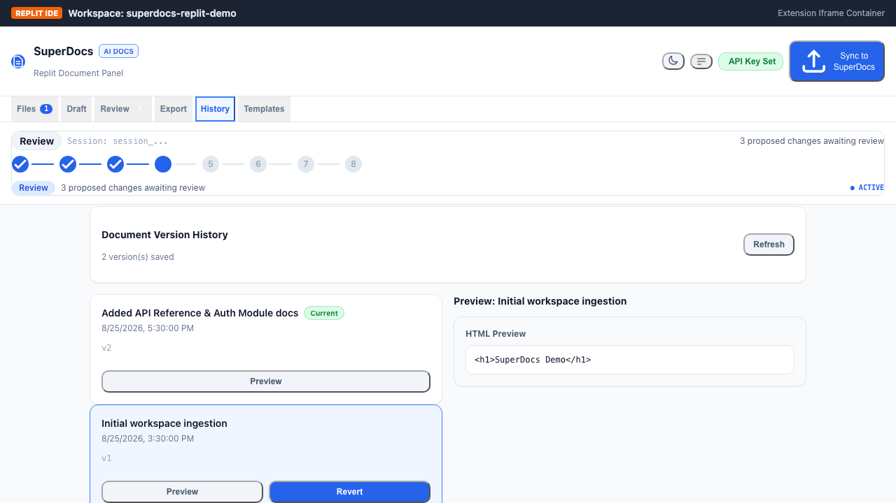

# Replit Workspace Document Panel

A modern, high-performance Replit extension that provides an interactive document panel for generating, reviewing, and exporting documentation (README, SPEC, User Guide) using SuperDocs AI directly inside your Replit workspace.

---

## 📸 Visual Showcase

### 1. Workspace File Tree & Dual-Theme UI (Dark & Light)


*Interactive workspace browser with multi-select staging, real-time search, file size indicators, and seamless Dark/Light theme switching.*

### 2. Animated API Key Modal Popover (`modal pop`)


*Zero-disk in-memory API key entry with glassmorphic backdrop blur and smooth spring entrance animations.*

### 3. Granular Cherry-Pick Diff Review & Live Rendered Preview


*Selective approval of AI-generated edits. Choose individual replace, insert, or delete operations with side-by-side diff previews and live synthesized document rendering.*

### 4. Collapsible Workspace Side Drawer


*Slide-out telemetry drawer displaying live active sessions, staged context sizes, zero-drift verification status, and token savings.*

### 5. Template Gallery & Dynamic Variable Injection


*Browse built-in documentation recipes with dynamic variable forms and real-time markdown template previews.*

### 6. SuperDocs Version History & Snapshot Rollbacks


*Inspect historical document snapshots, render previous HTML previews, and trigger one-click rollback.*

### 7. Clean Light Mode


*Polished light aesthetic with high-contrast typography and subtle borders.*

---

## ✨ Features & Capabilities

- **📁 Recursive File Browser**: File tree with search filtering, multi-select checkboxes, and smart ignore rules (excludes `node_modules`, `.env`, lockfiles, and binaries).
- **🤖 SuperDocs AI Document Generation**: Instant generation of README, SPEC, or User Guide from selected source files.
- **🔍 Granular Cherry-Pick Approval & Live Preview**: Selective human-in-the-loop review with real-time rendered document synthesis.
- **🧩 Symbol Outline Harvester (`src/services/outline.ts`)**: AST/Regex symbol extraction (functions, classes, interfaces, routes) providing 90%+ context density under strict token caps.
- **⚡ Zero-Drift Source Regeneration**: SHA-256 baseline hashing prevents unnecessary API token burns by only dispatching modified files (**91–97% token savings**).
- **🌓 Native Dark / Light Theme System**: Tailored dual-palette system matching Replit's modern design language.
- **🗄️ Collapsible Workspace Drawer**: Slide-out drawer displaying live telemetry, session tracking, and drift health.
- **🪟 Animated Modal Popovers**: Spring-animated modal dialogs for zero-persistence API key entry and overwrite confirmations.
- **📚 Template Gallery & Prompt Recipes**: Dynamic parameter injection with live markdown preview.
- **🕒 Version History & Snapshot Rollback**: Full SuperDocs v2 snapshot timeline with diff previews and rollback support.
- **💾 Workspace Filesystem Export**: One-click direct PDF / DOCX export to your Replit virtual workspace filesystem.

---

## 🏗️ Architecture & Data Flow

```
┌──────────────────┐     ┌──────────────────────┐     ┌───────────────────────┐
│ Replit Workspace │────▶│ Workspace Document   │────▶│ SuperDocs Cloud API   │
│ (Source Files)   │     │ Panel UI (React+TS)  │     │ (Upload / Async Chat) │
└──────────────────┘     └──────────────────────┘     └───────────────────────┘
        ▲                            │                            │
        │                            ▼                            ▼
        │                 ┌────────────────────┐       ┌──────────────────────┐
        │                 │ Zero-Drift Hashes  │       │ Proposed Diffs       │
        │                 │ (SHA-256 Baseline) │       │ (Double-JSON Decoded)│
        │                 └────────────────────┘       └──────────────────────┘
        │                            │                            │
        │                            ▼                            ▼
        │                 ┌────────────────────┐       ┌──────────────────────┐
        │                 │ Direct Replit FS   │◀──────│ Cherry-Pick Approval │
        └─────────────────│ PDF / DOCX Export  │       │ & Live Synthesizer   │
                          └────────────────────┘       └──────────────────────┘
```

---

## 🚀 Getting Started

### 1. Installation in Replit (Recommended)

1. Open your Repl project.
2. Open the Extensions manager.
3. Install or run locally:
   ```bash
   cd extensions/deadheaven07/replit-workspace-document-panel
   npm install
   npm run build
   ```

### 2. Local Development

```bash
cd extensions/deadheaven07/replit-workspace-document-panel
npm install
npm run dev
```

---

## 🧪 Comprehensive Test & Verification Suite

### 1. One-Shot Master Verification
Run all typecheck, unit, e2e, and build gates in a single command:
```bash
npm run verify
```

### 2. Headed Playwright End-to-End Suite
Runs a headed Chromium browser testing complete developer workflows inside the simulated Replit host runtime:
```bash
npm run test:e2e:headed
```

### 3. Vitest Unit & Integration Suite
```bash
npm test
```
```
Test Files  12 passed (12)
Tests       104 passed (104)
Duration    1.12s
```

---

## 📊 Token Efficiency Benchmark
See [`BENCHMARK.md`](BENCHMARK.md) for full benchmarks comparing zero-drift SHA-256 hashing vs. naive codebase resends.

---

## 🔒 Security & Privacy

- **Zero API Key Persistence**: API keys reside purely in React memory and are never written to disk, localStorage, or git history.
- **Workspace Isolation**: Respects `.gitignore` and blocks sensitive configuration files (`.env*`, credentials).
- **Context Safeguards**: 500KB ingestion cap with warning flags to avoid accidental token spillage.
- **Double-JSON Quirk Defense**: Resilient parser decodes SuperDocs nested JSON responses securely.

---

## 📄 License

MIT — SuperDocs Extension for Replit.