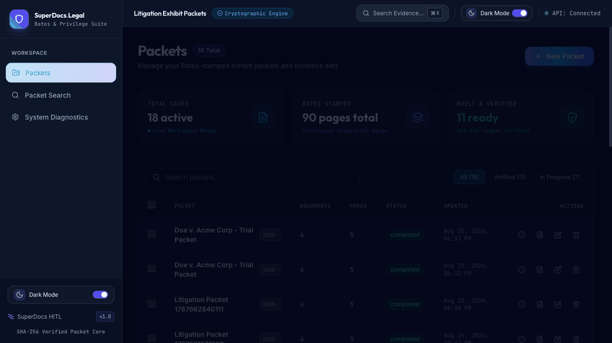
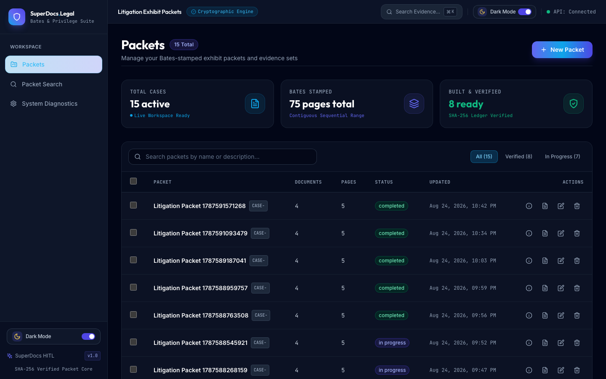
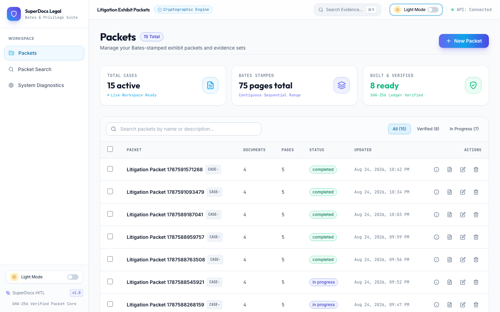
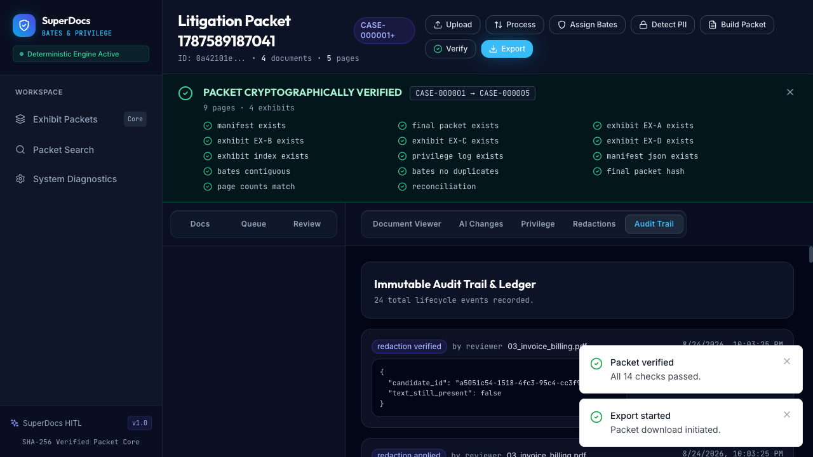

# Bates Exhibit & Privilege Packet Builder

> **Positioning:** This submission demonstrates a legal-document workflow built around impact analysis, targeted mutation, human approval, independent verification, failure discovery, SuperDocs API integration, and reproducible evidence tests.

**What it does:** Takes a pile of court exhibits (PDFs, DOCX, scans) and produces a single reconciled, Bates-stamped, privilege-logged, PII-redacted PDF packet with a SHA-256 manifest that anyone can independently verify.

**Who it's for:** Litigation support teams and legal analysts who manually assemble exhibit packets — a process that currently takes hours of copy-paste-redact-stamp work and is prone to human error (missing Bates numbers, leaked PII, broken privilege logs).

**Measured results (Unified Suite: 318 Automated Tests):**

| Test Suite / Target | Result | Command to Verify | Notes |
|---|---|---|---|
| **Canonical All-in-One Suite** | **318/318 passing** | `make test-all` | Runs full offline suite + 307-test backend DB suite + frontend tests |
| Full Backend DB Suite | **307/307 passing** | `make test-db` | PostgreSQL-backed at `TEST_DATABASE_URL`, passes with `SUPERDOCS_API_KEY` unset |
| ↳ Offline Unit & Safety Tier | **86/86 passing** | `make test-offline` | Zero dependencies, no DB, no API key, `DEBUG=false` |
| ↳ Offline Benchmark & Residue | **39/39 passing** | `make evidence-offline` | Ground truth precision/recall, 12 redaction residue proofs |
| ↳ DB-Backed Kill Matrix Tier | **71/71 passing** | `make evidence-db` | Adversarial crash recovery (K1–K9), zero double-stamping, OCR search |
| Frontend Component & Type Suite | **11/11 passing** | `make test-frontend` | Vitest component tests (PacketList, SearchPage) + strict TypeScript (`tsc --noEmit` clean) |
| Production Frontend Build | **succeeds** | `npm run build` (in `frontend/`) | Vite production bundle compiles cleanly |
| Headed E2E Playwright Suite | **2/2 passing** | `npx playwright test` | 12-step legal litigation workflow + persistent theme toggle |
| Live Cloud E2E Integration | **112/112 checks** | `python live_e2e_phase13.py` | Standalone verification script against running server + real SuperDocs API |

## 🎥 Task 2.1 Workflow



Upload → OCR → Bates Stamp → AI Review → Human Approval → Final Packet → Verification

## User Interface & Application Screenshots

### 🌙 Dark Mode Dashboard


### ☀️ Light Mode Dashboard


### 📑 End-to-End Legal Workspace & Verification


## What This System Actually Solves

Legal e-discovery has three hard problems this system addresses:

1. **Bates numbering must be contiguous and idempotent.** If the process crashes on page 45 of 100, resuming must produce pages 1–45 unchanged and continue at 46. No gaps, no double-stamping. Proven by `test_evidence_crash_recovery.py` and `test_evidence_zero_double_stamping.py`.

2. **Redacted text must actually be gone.** A redaction that leaves extractable text is a compliance violation. The byte scrubber removes text from the PDF content stream (not paint-over), and the verifier confirms absence. Proven by `test_evidence_redaction_residue.py` (12 offline tests, no DB required).

3. **The exported packet must be independently verifiable.** Every file in the manifest has a SHA-256 hash. Anyone can re-hash the files and compare. Proven by `test_evidence_manifest_reconciliation.py`.

## Trust Model

```
    SUPERDOCS (AI proposes)
         │
         │  PII detection, privilege analysis
         │  approval_mode="ask_every_time"
         ▼
    HUMAN REVIEW (human approves)
         │
         │  Approve / Reject each proposal
         │  Record approver + timestamp
         ▼
    DETERMINISTIC CORE (system proves)
         │
         │  Byte-scrub → Verify text gone
         │  Bates → Contiguous, crash-recoverable
         │  Manifest → SHA-256 for every artifact
         ▼
    VERIFIED PACKET
```

**AI must never auto-redact. Every redaction requires human approval. The system proves what happened via byte-level verification and SHA-256 manifests.**

## Processing Stages & Agentic Pipeline

The system is organized into 12 explicit processing stages with clear input/mutation boundaries, audit evidence, and failure handling:

| Stage | Input | Mutation | Audit / Verification Evidence | Failure / Missing Dependency Handling |
|---|---|---|---|---|
| **1. Ingest** | Uploaded file stream (PDF, DOCX, scan) | Saves to `originals/{sha256}.ext`, creates `Document` DB record | `PROCESSING_STARTED` audit event, SHA-256 hash computed | Invalid MIME/oversized rejected; failed uploads roll back with zero orphan files |
| **2. OCR & Searchability** | Original file | Extracts text via PyMuPDF / pdfplumber; runs Tesseract OCR via PyMuPDF pixmaps if scanned | Text stored in `Page.extracted_text`, sets `is_searchable = bool(extracted_text)` | If Tesseract is absent or yields no text, document is marked `is_searchable = false` (best-effort) |
| **3. Content Descriptions** | `Page.extracted_text` | Generates summary skipping boilerplate via `description_generator.py` | `description` and `description_source = "content_summary"` in DB | Falls back to filename-based summary only if extracted text is empty |
| **4. Bates Assignment** | Packet config + `Page` records | Computes sequential numbers via `BatesJournal`, assigns page-level ranges | `BatesAssignment` rows + `BATES_ASSIGNED` audit event | Idempotent page skip; resumes at `MAX(bates_number) + 1` without gaps |
| **5. Privilege Review** | Document text + metadata | Queries SuperDocs API (or local rules) for attorney-client indicators | `PrivilegeDecision` proposal created in `pending` status | Falls back to local deterministic heuristic if API key is absent |
| **6. Redaction Proposal** | Document text + coordinates | Queries SuperDocs API (or regex fallback) for SSN, phones, emails, accounts | `RedactionCandidate` rows created in `PROPOSED` status | Regex fallback engine ensures offline detection without external API |
| **7. Human Approval** | Reviewer actions | Updates candidate status to `APPROVED` or `REJECTED` | `RedactionApproval` record with approver ID and timestamp | Unapproved candidates are never scrubbed; rejected items are immutable |
| **8. Byte-Scrub Application** | Pristine base PDF + `APPROVED` candidates | `RedactionByteScrubber` removes text stream bytes into `working/{sha256}_redacted.pdf` | `RedactionVerifier` scans output to mathematically prove text removal | Fails build if target text is still detectable in output stream |
| **9. Packet Build** | Stamped/redacted exhibits, index, log | Compiles cover sheets, stamps, index PDF, privilege log PDF, `manifest.json` | Files written to `final/{packet_id}/` | Pre-build validation catches unapproved items or broken sequences |
| **10. Manifest Reconciliation** | Built artifacts in `final/` | Computes SHA-256 hashes for final packet and each exhibit entry | `manifest.json` with masked PII (`matched_text` → `***`) | Build halts if computed SHA does not match generated artifact |
| **11. Export & Download** | Verified artifacts | Delivers ZIP/PDF downloads to client | `PACKET_EXPORTED` audit event | Clean 404/400 if packet not yet built |
| **12. Verification & Audit** | Full packet graph + artifacts | Runs 15 automated integrity checks (`verify_packet`) | Structured `verifyResult` JSON + `PACKET_VERIFIED` audit event | Reports exact check failures with remediation hints |

## Key Capabilities

- **Packet management** — create, rename, list, reorder, and delete exhibit packets.
- **Document ingestion** — accepts PDF, DOCX (via LibreOffice), scanned PDFs and images (via PDF images), with OCR fallback.
- **Content-derived descriptions** — exhibit descriptions are generated from document content (OCR/native text), not filenames. Filenames are used only as a last-resort fallback.
- **Bates numbering** — contiguous assignment per page, auto on upload, manual assign, and automatic re-stamping on reorder.
- **PII redaction** — detects SSNs, phone numbers, emails, names, account numbers (including alphanumeric `ACC-8821-4433`-style values) and medical terms.
- **Redaction workflow** — detect → propose → review/approve → apply → verify that redacted text is actually gone.
- **Privilege marking** — mark documents `privileged` / `not_privileged`, with reason/category, override, and a machine + human-readable privilege log.
- **AI review** — delegates to the SuperDocs API for drafting/review; sessions are reused per document and failures leave the document in a recoverable state.
- **Packet build** — cover sheets, stamps, exhibit-index PDF, privilege log, and a `manifest.json` with SHA-256 hashes for the final packet, every exhibit, and every source entry.
- **Interactive PDF Bookmarks** — hierarchical Table of Contents outlines injected directly into the final PDF packet for immediate Acrobat/e-filing navigation between Exhibit covers and document pages.
- **Packet verification** — structured verification checks artifacts, Bates contiguity, page counts, SHA-256 hashes, and reconciliation before export.
- **Content search** — search across document content, filenames, descriptions, and Bates labels with page-level results and snippets.
- **Validation & integrity** — validation pass before build; manifest SHAs are re-checked at build time.
- **Export** — final packet, per-exhibit PDFs, privilege log, and manifest for download.
- **Audit trail** — every significant lifecycle event (upload, processing, Bates, redaction, privilege, validate, build, AI) is recorded with metadata.
- **Reference-aware storage cleanup** — original/stamped/redacted files are deleted only when no document references them; uploads roll back on failure so no orphan files are left.
- **Theme Switcher** — persistent Light Mode and Dark Mode toggle available across the top header and sidebar.
- **Fast Keyboard Navigation** — global Quick Search trigger shortcut (`⌘K` / `Ctrl+K`) for immediate evidence lookups.
- **Matter Presets** — 1-click preset templates (*Commercial Contract Breach*, *Medical & Health Records*, *Corporate Strategy & Audit*) for instant case setup.

## Supported Formats & OCR / Searchability

Accepts **DOCX**, **native PDFs**, **scanned PDFs**, and **image formats** (PNG, JPG, TIFF, WebP).
- **Native text & searchability:** Native PDFs and converted DOCX documents have their text extracted per page into `Page.extracted_text` and indexed for full-text search.
- **Scanned PDF & image OCR:** When native text is absent, Tesseract OCR (driven via PyMuPDF image rendering without external Poppler dependencies) extracts text layers into `Page.extracted_text`.
- **Searchable PDF layer:** Generation of an invisible searchable text layer is best-effort. If OCR dependencies are absent or extract no text, the document is honestly marked `is_searchable = false` and ingestion continues without breaking the pipeline.
- **Dependencies:** Tesseract (`tesseract`) for OCR, LibreOffice (`libreoffice`) for DOCX conversion. Both are pre-installed in the Docker images.

## Architecture

- **Backend:** FastAPI + SQLAlchemy (async, PostgreSQL), organized into API / services / domain / workers / storage / SuperDocs adapter layers. Alembic migrations under `backend/alembic`.
- **Frontend:** React + TypeScript, built with Vite, tested with Vitest, typed with `tsc`.
- **External:** PostgreSQL for relational state and audit; file storage for artifacts; the SuperDocs API for AI review (key kept server-side only).

See [ARCHITECTURE.md](ARCHITECTURE.md) for the full architecture.

## Core Workflow

```
INGEST → Validate → Process (OCR/text extraction)
    → CONTENT UNDERSTANDING (content-derived descriptions)
    → SUPERDOCS INTELLIGENCE (PII detection + privilege analysis via async chat)
    → SEARCH (content, filenames, descriptions, Bates labels)
    → REVIEW (human examines AI proposals)
    → APPROVAL (human approves/rejects each redaction + privilege decision)
    → REDACTION (byte-scrub approved candidates, verify text is gone)
    → BATES (contiguous numbering, crash-recoverable)
    → BUILD (covers + stamps + index + privilege log + manifest)
    → VERIFY (artifacts, Bates, page counts, SHA-256, reconciliation)
    → EXPORT
```

**Core principle: AI proposes. Human approves. System proves.**

## Tech Stack

| Technology                | Purpose            | Why                                             |
| ------------------------- | ------------------ | ----------------------------------------------- |
| Python 3.11+              | Backend runtime    | Ecosystem for PDF/PDF tooling, FastAPI async    |
| FastAPI                   | API framework      | Typed, async, automatic OpenAPI + validation    |
| SQLAlchemy 2.0            | ORM/persistence    | Async sessions, transactional workflows         |
| PostgreSQL                | Database           | Relational integrity for packet/document/state  |
| Alembic                   | Migrations         | Schema evolution                                |
| PyMuPDF (fitz)            | PDF rendering/text | Redaction detection, cover sheets, verification |
| pypdf                     | PDF assembly       | Final packet stamping and assembly              |
| pdfplumber                | Text extraction    | PII detection on text layers                    |
| pdf2image + Tesseract     | OCR/imaging        | Scanned-image text extraction                   |
| python-docx + LibreOffice | DOCX → PDF         | Convert Word exhibits                           |
| python-magic              | MIME detection     | Upload type validation                          |
| Pillow                    | Image handling     | Image-based PDF ingestion                       |
| httpx + tenacity          | SuperDocs client   | HTTP + retries for the external AI API          |
| React 18                  | Frontend UI        | Interactive workspace                           |
| TypeScript                | Frontend typing    | Type-safe API integration                       |
| Vite                      | Frontend build/dev | Fast dev server + build                         |
| Vitest                    | Frontend tests     | Unit/component test runner                      |
| Playwright                | E2E Testing        | End-to-end browser automation & headed verification |
| Tailwind CSS              | Styling            | Utility CSS                                     |
| @tanstack/react-query     | Data fetching      | Server state caching                            |
| Zustand                   | State management   | Lightweight global store                        |
| SuperDocs API             | AI review          | External provider for drafting/analysis         |

## Reviewer Happy Path (Step-by-Step Demo)

Follow this deterministic sequence to evaluate the full end-to-end workflow:

1. **Start the Application**:
   ```bash
   docker compose up --build
   ```
2. **Open Frontend Workspace**: Navigate to `http://localhost:5173`.
3. **Create Exhibit Packet**: Click `+ New Packet`, select a Matter Preset or name it `Doe v. Acme Corp - Trial Packet`, set Bates prefix to `CONF-` and start number to `1`.
4. **Upload Mixed Exhibits**: Upload sample PDF, DOCX, or scanned files from the test corpus (`backend/app/tests/corpus/` or your own files).
5. **Review Content-Derived Descriptions**: Notice that exhibit titles/descriptions are generated from extracted document text, not naive filenames.
6. **Review & Mark Privilege**: Navigate to the **Privilege** tab, inspect attorney-client flag proposals, and mark/override privilege decisions with categorical justifications.
7. **Inspect AI Redaction Proposals**: Open the **Redactions** tab to review detected PII (SSNs, phone numbers, account numbers, email addresses).
8. **Approve / Reject Redactions**: Click **Approve** on valid PII candidates and **Reject** on false positives, then click **Apply & Verify Redactions** to execute byte-level scrubbing.
9. **Build Reconciled Packet**: Click **Build Final Packet** to compile covers, Bates stamps, exhibit index PDF, privilege log, and cryptographic manifest.
10. **Run Cryptographic Verification**: Click **Verify Packet** to execute the 15-point automated validation confirming file SHAs, Bates contiguity, and zero unapproved redaction leakage.
11. **Download Deliverables**: Download the compiled final packet PDF, individual Bates-stamped exhibits, privilege log CSV/PDF, and `manifest.json`.
12. **Verify via CLI**:
    ```bash
    make test-offline       # 86 tests (zero DB, zero API key)
    make evidence-offline   # 39 tests (resilience & residue proofs)
    make test-frontend      # 7 component tests + TypeScript check
    npx playwright test     # 2 headed/headless E2E suites
    ```

### Prerequisites

- Python 3.11+
- Node.js 18+
- PostgreSQL 16 (the `docker-compose.yml` starts one)
- **Recommended for full functionality:** LibreOffice (`libreoffice`) and Tesseract (`tesseract`) on `PATH`. Without them, DOCX conversion and OCR are disabled — document processing still works for text-based PDFs (see [Known Environment Requirements](#known-environment-requirements)).
- A SuperDocs API key (set `SUPERDOCS_API_KEY`).

### Backend (Manual)

```bash
cd backend
python -m venv venv && source venv/bin/activate
pip install -e ".[dev]"
cp .env.example .env   # then fill in SECRET values
# start PostgreSQL (one terminal)
docker compose up -d
# start the API
uvicorn app.main:app --reload --port 8000
```

The API is then available at `http://localhost:8000` (OpenAPI at `/docs`).

### Frontend (Manual)

```bash
cd frontend
npm install
npm run dev    # → http://localhost:5173
```

### Environment Variables

Copy `.env.example` (backend). All secrets live only in `.env` (gitignored):

| Variable                                                     | Required        | Default                         | Description                                                  |
| ------------------------------------------------------------ | --------------- | ------------------------------- | ------------------------------------------------------------ |
| `SUPERDOCS_API_KEY`                                          | yes (AI review) | `your-key-here`                 | SuperDocs API key — server-side only, never sent to clients. |
| `SUPERDOCS_BASE_URL`                                         | no              | `https://api.superdocs.app`     | SuperDocs endpoint.                                          |
| `DATABASE_URL`                                               | yes             | —                               | PostgreSQL connection string.                                |
| `STORAGE_ROOT`                                               | no              | `./storage`                     | Root for original/processed/working/final files.             |
| `ORIGINALS_DIR`, `PROCESSED_DIR`, `WORKING_DIR`, `FINAL_DIR` | no              | `originals`, …                  | Subdirectory names.                                          |
| `TESSERACT_CMD`, `TESSERACT_LANG`                            | no              | `tesseract`, `eng`              | OCR configuration.                                           |
| `BATES_PREFIX`, `BATES_START_NUMBER`, `BATES_PADDING`        | no              | `CASE-`/`1`/`6`                 | Defaults.                                                    |
| `APP_HOST`, `APP_PORT`, `DEBUG`, `LOG_LEVEL`                 | no              | `0.0.0.0`/`8000`/`false`/`INFO` | Runtime (`DEBUG=false` forced in test targets).             |

## Testing & Verification Commands

A stranger can verify this build with clearly categorized `make` targets:

```bash
# 1. Tier 1: Offline Unit & Safety Suite (zero DB, zero API key, DEBUG=false forced)
make test-offline

# 2. Tier 1 (Evidence): Offline Benchmark & Residue Suite (no DB required)
make evidence-offline

# 3. Tier 2: DB-Backed Evidence & Kill Matrix (requires PostgreSQL test database)
make evidence-db

# 4. Tier 2 (Full Backend): Full 307-Test PostgreSQL Suite
make test-db

# 5. Tier 3: Frontend Component Tests & Typecheck
make test-frontend

# 6. Tier 3 (E2E): Headed Playwright E2E Test Suite
npx playwright test
```

### Verified Test Counts & Requirements

- **Offline Evidence & Logic Suite (`make test-offline`):** **86 passed** in ~1.1s (zero DB, zero network, no API key). Proves byte scrubber removes PII text, verify confirms absence, state machine invariants, content-derived description extraction, MIME ingestion, SuperDocs parser boundaries, and fallback precision/recall metrics.
- **Offline Evidence & Benchmark (`make evidence-offline`):** **39 passed** in ~0.35s (no DB required). Runs evaluation metrics against ground truth corpus, 12 redaction residue tests, 10 safety rejection tests, and Bates journal continuity proofs.
- **DB-Backed Evidence & Kill Matrix (`make evidence-db`):** **71 passed** in ~32s (requires PostgreSQL). Runs adversarial kill matrix (interrupted stamping, crash resume, zero duplicates), manifest SHA reconciliation, OCR searchability, and full chain of custody audit traces.
- **Full Backend Suite (`make test-db`):** **307 passed** in ~52s (requires PostgreSQL at `TEST_DATABASE_URL`). Comprehensive integration, API endpoints, transactions, and state transitions.
- **Frontend Suite (`make test-frontend`):** **7/7 passed** Vitest tests, TypeScript compile clean (`npx tsc --noEmit` returns 0 errors).
- **Playwright E2E Suite (`npx playwright test`):** **2/2 passed** (headed legal workflow + persistent theme toggle).
- **Live E2E Verification (`python live_e2e_phase13.py`):** **112/112 checks passed** against running backend server + real live SuperDocs API key.

## Security

- The SuperDocs API key is loaded from the server `.env` only and is **never** returned by any endpoint or exposed to the frontend.
- `.env`, `storage/`, `*.pdf`, `*.docx`, caches, and build output are gitignored.
- Upload validation checks MIME type and file content, and corrupt files are rejected before persistence.
- A failed upload rolls back all files (no orphan originals left on disk).
- `manifest.json` masks applied-redaction text (`matched_text` → `***`) so raw PII is not present in any delivered artifact.
- All final artifacts (final packet, covers, exhibit index, privilege log, exhibits, manifest) are scanned to be free of seeded PII.
- Privilege decisions validate the document belongs to the request's packet (UUID-to-UUID comparison), preventing cross-packet access.
- SuperDocs provider errors are translated to generic, controlled messages; raw provider bodies and keys are never surfaced.
- SHA-256 hashes in the manifest allow independent verification of exported packet integrity.

## Reliability / Idempotency

- **Redaction detection** is idempotent — repeated `detect` calls upsert candidates by identity and never duplicate, never delete approved/applied candidates.
- **Rebuilt packets** replace artifacts safely and re-verify manifest hashes.
- **Duplicate uploads** of identical content are rejected with `409`.
- **File deletion** is reference-aware — a shared source file is removed only when the last referencing document is deleted.
- **SuperDocs session reuse** — re-running analysis on a document reuses its existing session instead of re-uploading.
- **Failed AI analysis** reverts the document to `completed` so it is never stuck in `ai_analysis`.
- **Bates assignment is idempotent** — `assign_bates()` in `backend/app/services/bates_assignment.py` implements graceful re-entry:
  - No destructive wipe: existing assignments are never deleted; already-assigned pages are skipped.
  - `MAX(bates_number)` resume: computes `next_number = MAX(bates_number) + 1` (or falls back to `bates_start_number` on first run).
  - `assigned_pages` tracking: builds a set of `(document_id, page_number)` tuples for pages already assigned.
  - Page-level skip: when iterating documents/pages, any page whose key exists in `assigned_pages` is skipped entirely.
  - Document removal: if previously assigned documents no longer exist, all assignments are cleared and remaining documents are renumbered from `bates_start_number` to produce a contiguous sequence.
- **Result:** If the process is killed on page 45 of 100, pages 1–45 are already persisted with contiguous Bates numbers 1–45. On restart, the query returns `max_bates = 45`, `next_number = 46`, and the `assigned_pages` set contains pages 1–45. The loop skips them and resumes cleanly at page 46. No double-stamping, no gaps, no manual intervention.
